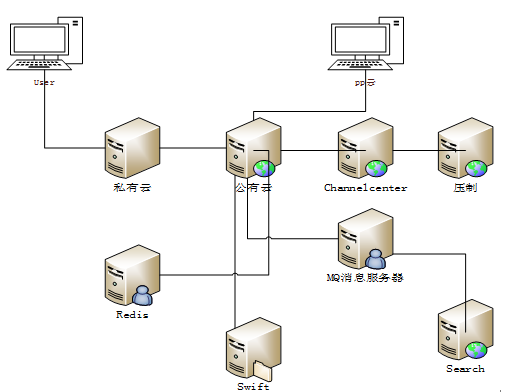
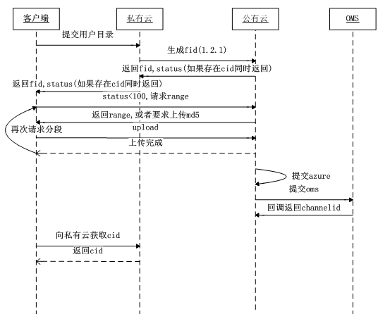
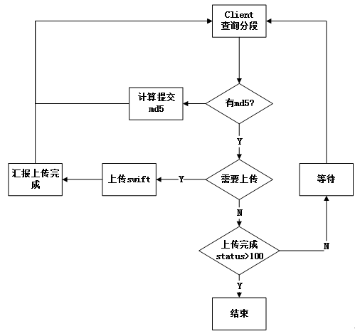

@(工作)
## 公有云系统文档
### 1.功能概要
公有云模块能满足用户通过客户端，网页，PP云分块上传视频，以及对重复上传视频进行秒传，存入公司自建机房，并为后台审核服务提供视频审核打标签等服务功能。
### 2架构图
#### 2.1 系统架构图



#### 2.2系统关系模块
- 私有云 ：普通用户入口，可上传用户自己视频
- pp云：企业用户入口
- channelcenter：负责生成cid
- oms：公有云上传完成后，会通过通知oms压制视频
- search ：存放公有云视频检索信息，以及供审核后台审核
- swift：存放具体分块视频文件

### 3时序流程图

#### 3.1上传视频文件过程详解
 


#### 3.2Client上传文件



#### 3.3具体上传过程
##### 3.3.1通过客户端上传文件
客户端插件（PP云）请求公有云`{host}/fsvc/private/1/file?from=private_cloud `生成`fid`
##### 3.3.2生成fid
根据公司自有计算规则`PPfeature`，判断是否存在，如果存在则**秒传**，如果不存在这返回fid
PPfeature 规则，通过fileSize和python脚本计算出的feature
```python
def lib_hash_file(h, path):
	with open(path, 'rb') as stream:
		while True:
			bytes = stream.read(1024*1024)
			if not bytes:
				break
			h.update(bytes)
	return h.hexdigest()

def sha1_hash_file(path):
	return lib_hash_file(hashlib.sha1(), path)

def verify_sha1(path, sha1):
	return sha1_hash_file(path).lower() == sha1.lower()

def md5_hash_file(path):
	return lib_hash_file(hashlib.md5(), path)

def verify_md5(path, md5):
	return md5_hash_file(path).lower() == md5.lower()

def md4_hash_file(path):
	return lib_hash_file(hashlib.new('md4'), path)

def verify_md4(path, md4):
	return md4_hash_file(path).lower() == md4.lower()

def dcid_hash_file(path):
	h = hashlib.sha1()
	size = os.path.getsize(path)
	with open(path, 'rb') as stream:
		if size < 0xFFFF:
			h.update(stream.read())
		else:
			h.update(stream.read(0x3000))
			stream.seek(size/5)
			h.update(stream.read(0x3000))
			stream.seek(2*size/5)
			h.update(stream.read(0x3000))
			stream.seek(3*size/5)
			h.update(stream.read(0x3000))
			stream.seek(size-0x3000)
			h.update(stream.read(0x3000))
	return h.hexdigest()

def verify_dcid(path, dcid):
	return dcid_hash_file(path).lower() == dcid.lower()

def main(args):
	option = args.pop(0)
	def verify_bt(f, t):
		from lixian_progress import SimpleProgressBar
		bar = SimpleProgressBar()
		result = lixian_hash_bt.verify_bt_file(t, f, progress_callback=bar.update)
		bar.done()
		return result
	if option.startswith('--verify'):
		hash_fun = {'--verify-sha1':verify_sha1,
					'--verify-md5':verify_md5,
					'--verify-md4':verify_md4,
					'--verify-dcid':verify_dcid,
					'--verify-ed2k':lixian_hash_ed2k.verify_ed2k_link,
					'--verify-bt': verify_bt,
				   }[option]
		assert len(args) == 2
		hash, path = args
		if hash_fun(path, hash):
			print 'looks good...'
		else:
			print 'failed...'
	else:
		hash_fun = {'--sha1':sha1_hash_file,
					'--md5':md5_hash_file,
					'--md4':md4_hash_file,
					'--dcid':dcid_hash_file,
					'--ed2k':lixian_hash_ed2k.generate_ed2k_link,
					'--info-hash':lixian_hash_bt.info_hash,
				   }[option]
		for f in args:
			h = hash_fun(f)
			print '%s *%s' % (h, f)
```
##### 3.3.3计算seg
公有云根据文件**fileinfo**中设置的**segSize**来计算文件中分块数
具体分块大小规则为
```java
public static final long AZURESEGSIZE = 1024*1024*4L;
	public static final long MINSWIFTSEGSIZE = 1024*1024*4L;
	public static final long MAXSWIFTSEGSIZE = 1024*1024*40L;
```
通过计算文件fileSize大小和具体segSize来确定分块数量， 
##### 3.3.4 请求上传range
文件开始上传时会根据请求上传分块接口设定的参数seg来确定要获取多少个分块
`/fsvc/2/file/{fid}/action/uploadrange?feature_pplive=1234567890abcdef&segs=3& fromcp=xxxx&inner=true/false&asyncMD5=true/false`
```java
private String swiftLocalUrl = "http://swift.pplive.cn/v1/AUTH_3dfa6a72bb0443758d16edad1ceee994";
rivate String getLocalFileLocateUrl(FileInfo fileInfo){
      StringBuilder sb = new StringBuilder(swiftLocalUrl);
   sb.append(URL_SPLIT).append(getContainer(fileInfo)).append(URL_SPLIT).append(fileInfo.getFileId())
         .append(URL_SPLIT).append(StorageUtil.getFileName(fileInfo.getMd5(), fileInfo.getFileSize()));
      
      return sb.toString();
   }

private String getContainer(FileInfo fileInfo){
      if( fileInfo.getAccountId() == null ) {
         throw new CloudDiskRtException("account should not be null. fid:" + fileInfo.getFileId());
      }
      return "video" + fileInfo.getAccountId();
   }
   public static String getFileName( String fileMd5, long fileLength ){
      return fileLength + "-" + fileMd5 + ".ppc"; 
   }
```
返回数据
```json
{"err":0,"data":{"ranges":[{"start":0,"end":1023,"bid":"123456", "url":"http://url"},{"start":1024,"end":2047,"bid":"abcdef", "url":"http://url"}] , "status":0,"needMD5":true,"needGCID":true,"needCID":true}}
```
##### 3.3.5生成通过fileLog
具体根据要上传seg数量生成通过fileLog相同文件的fileLog会存入redis，然后每次上传请求分块时候，会通过查询redis获取当前没有上传的
如当前文件请求上传，会根据传入参数segs=3，会先通过查询redis，看当前redis中有无seg信息，如果没有，则直接添加seg=1,seg=2,seg=3信息到`fsvc:segs:{fid}`中，后面每请求一次都然后通过之前fileinfo中数据计算fileLog中信息
```java
	private Long id;
	private Long fileId;		//file Id
	private Integer seg;		//在所在文件中对应的范围
	private String blockId;		//azure block id
	private Date uploadTime;	//上传时间
	private String md5;
	private Boolean committed;
	private String uploadId;
	private CloudStorage storage; 
```
##### 3.3.6提交fileLong和range信息
swfit提供的接口地址通过http请求上传分块文件同时在下一次请求过来会通过后台**锁定当前上传块**，同一文件同时只能有一个人上传锁定**30S**
每一个分块上传完成后在redis中添加相应已经上传好了的seg信息，并且调用后台汇报接口
上传进度条就是根据redis中已经有的seg信息，以及通过fileinfo计算总共seg数百分比
```java
public void testUploadToSwift() {
		String upload_url = "http://swift.pplive.cn/v1/AUTH_3dfa6a72bb0443758d16edad1ceee994/video108/3301/9032438-20fe1799a3b62616a190c14e3353fdda.ppc/1-NjM2MmRlMjAtNDY1My00NDhlLThmMGItZTdkMGJkMjczODFh?temp_url_sig=57ea86716a03a51806c88be79c4ab0f74c28fedd&temp_url_expires=1407926140";
		String block_Id = "1-NjM2MmRlMjAtNDY1My00NDhlLThmMGItZTdkMGJkMjczODFh";
		HttpPut put = new HttpPut(upload_url);
		put.addHeader("x-ms-version", "2012-02-12");
	}
```
##### 3.3.7 通知oms
当所有分块上传完成后，会更新文件status状态，并且调用oms接口，***通知oms文件上传完成进行压制***

### 4数据库设计
#### FileInfo

| 字段                      | 类型            | 备注                                       |
| ----------------------- | ------------- | ---------------------------------------- |
| fid                     | Long	Fid      |                                          |
| md5                     | Varchar(32)   | 文件MD5                                    |
| file_size               | Long          | 文件长度                                     |
| insert_time             | timestamp     | 插入时间                                     |
| download_url=account_id | varchar(2048) | 下载地址                                     |
| channel_id              | Long          | 可以播放的id                                  |
| imgs                    | varchar(1024) | 截图                                       |
| default_img             | varchar(64)   | 默认截图                                     |
| status                  | Int           | 上传状态（上传中0-99，转码中100-199，200-299 可播放，>300已删除） |
| last_update_time        | timestamp     | 修改时间                                     |
| segsize                 | bigint        | 分块大小                                     |

Insert时，必须有fid，file_size。
partition by fid
Index status
TBD：回调私有云失败是否需要重试，是否需要重试。如果需要，是否应该建立一张fid->status的表，来快速查找并重试。

```java
public static final Integer NEW_ADD_STATUS = 0;  //表示新文件
public static final Integer UPLOADING_STATUS = 50; //上传中
public static final Integer UPLOADED_STATUS = 100;	 //上传完成
public static final Integer OMS_CODING_NOTIFIED_STATUS = 101;	 //通知转码完成
public static final Integer OMS_CODING_FAILED_STATUS = 150;	 //通知转码失败
public static final Integer FINISH_CODING = 200;	//转码完成
public static final Integer DELETED = 301;	 //已被删除
```


#### Filelog
Partition by upload_time. Keep lastest7 days file upload log.  

| 字段          | 类型            | 备注                  |
| ----------- | ------------- | ------------------- |
| id          | Long          | 自增id                |
| fid         | Long          | Fid                 |
| upload_time | datetime      | 上传时间                |
| bid         | Varchar(64)   | azure block id      |
| seg         | Int           | 属于文件第几段             |
| md5         | varchar(32)   | 段落md5，option        |
| storage     | tinyint       | 0:azure     1:swift |
| uploadid    | Varchar(1024) |                     |
| committed   | tinyint       | 是否已经commit          |

partition by upload_time
index fid,upload_time


#### FileFeature
根据fid，查询feature  

| 字段            | 类型          | 备注      |
| ------------- | ----------- | ------- |
| id            | Long        | 自增id    |
| fid           | Long        | Fid     |
| feature_name  | varchar     | feature |
| feature_value | Varchar(64) | xxx     |
| checked       | int         | 是否被计算校验 |
| insert_time   | timestamp   | 插入时间    |

Partition by fid

#### FileFeatureRevert
根据featrue反查fid 

| 字段          | 类型          | 备注      |
| ----------- | ----------- | ------- |
| id          | Long        | 自增id    |
| key         | varchar     | feature |
| value       | Varchar(64) | xxx     |
| fid         | Long        | Fid     |
| insert_time | timestamp   | 插入时间    |

Partition by value


#### FileExtend

| 字段          | 类型          | 备注                       |
| ----------- | ----------- | ------------------------ |
| id          | Long        | 自增id                     |
| fid         | Long        | Fid                      |
| key         | varchar     | filename,director,actors |
| value       | Varchar(64) | xxx                      |
| insert_time | timestamp   | 插入时间                     |
| count       | int         | Extend的count             |

Partition by fid

### 5 Redis设计 cache

#### 5.1 feature->fid

`Key: feature, Value: fid`

#### 5.2 fid -> segs

`Key: fid, Value:score set, score: time, value:seg`
将一个文件的所有分段号，存在score set中，每次请求range，优先返回最近无人访问seg。
score为下次可以获得seg的时间，获得seg后，将seg重新放入score set，将score=currenttime+  30s，意思为，  30秒后可被其他人获得该段并上传。

#### 5.3 fid -> file info
```
Key:fid, Map->fileinfo
Key:fid， Map->feature
```

#### 5.4  标识commit 

`Key: fsvc:committing:{fid}` 以上传完成，未提交的文件，在请求时，如果key不存在，则提交。
`Key: fsvc:uploadflag:{fid}` 未完全提交的文件，在请求时，如果key不存在，且committingkey也不存在，则提交。


